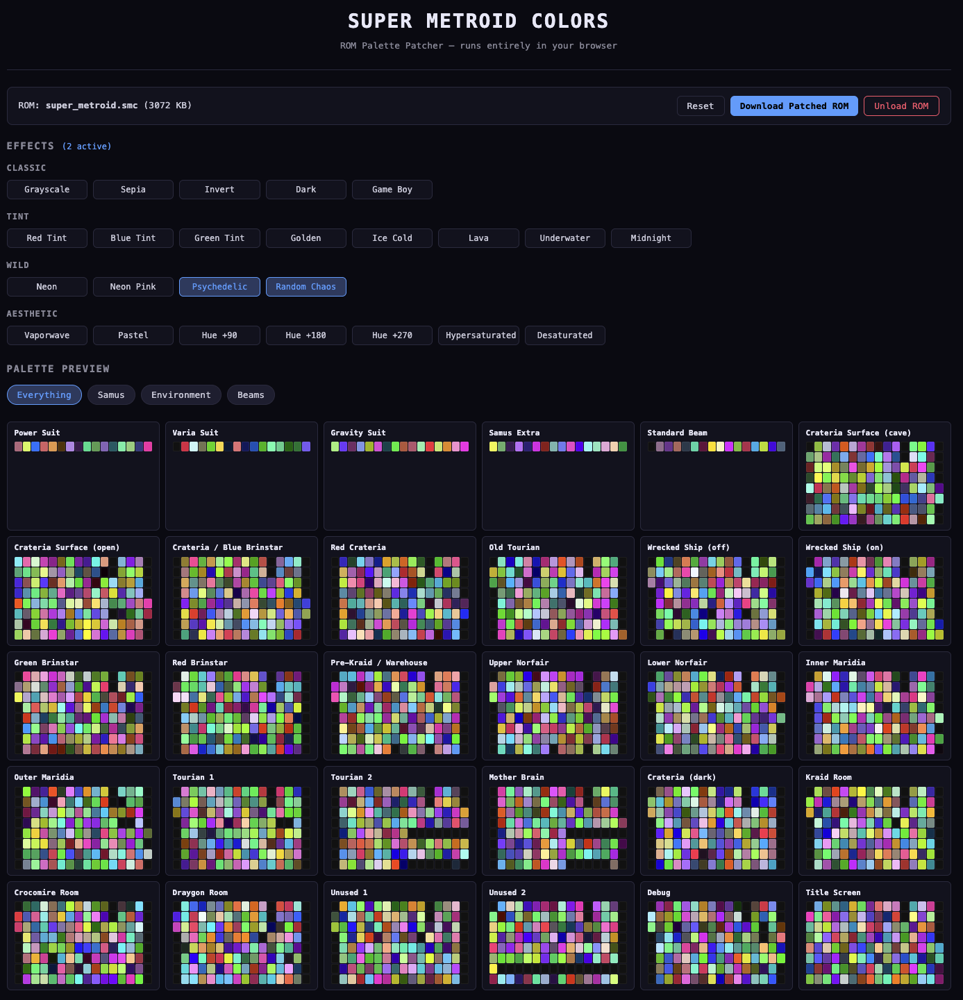
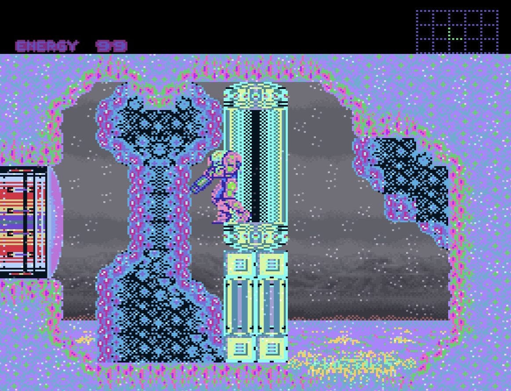
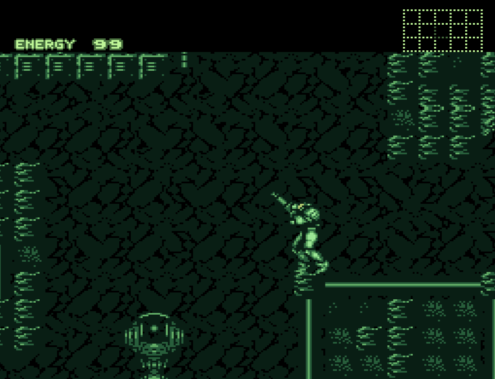
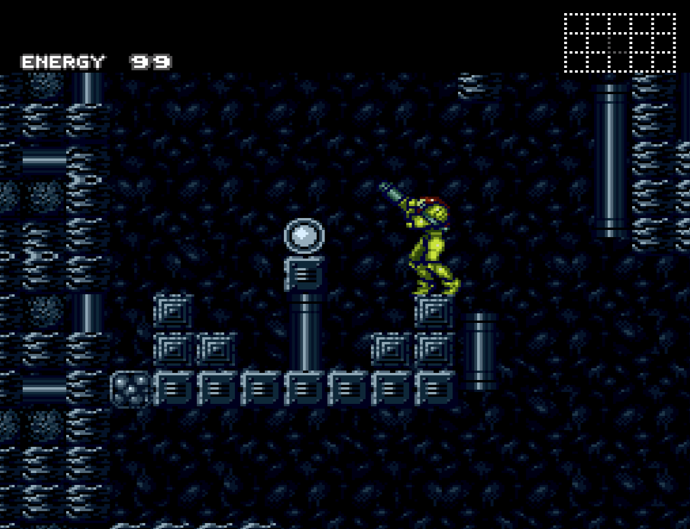
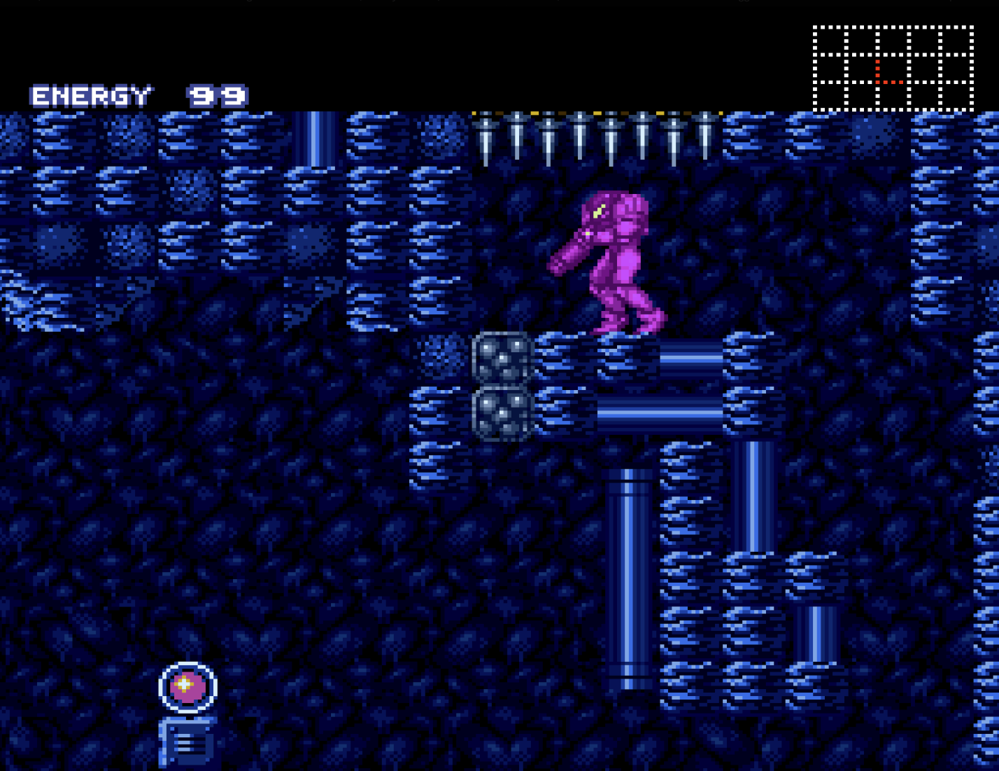
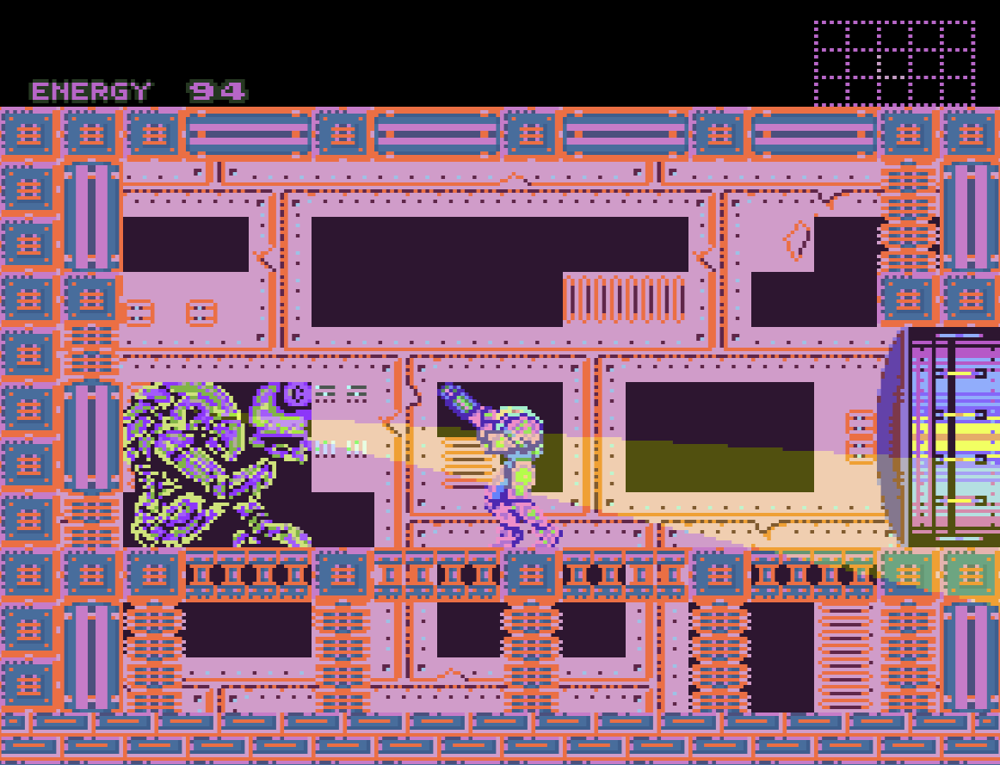
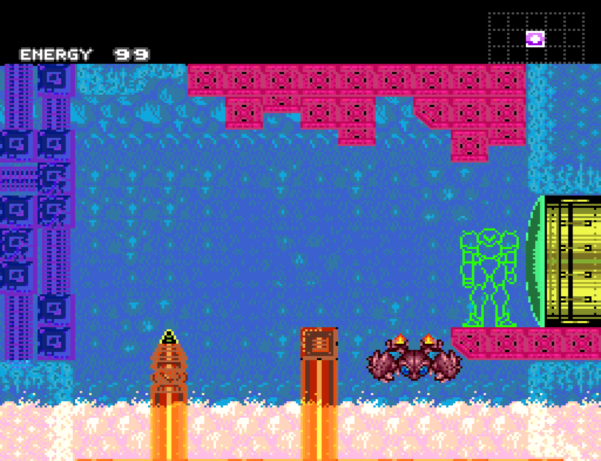
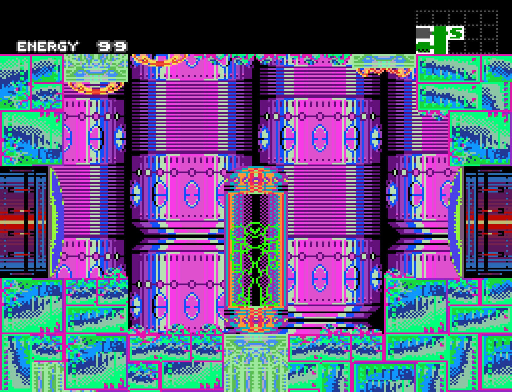

# Super Metroid Colors

ROM palette patcher for Super Metroid. Runs entirely in your browser — upload a ROM, toggle color effects, preview palettes, and download a patched ROM.

Supports both Samus/beam palettes and LZ5-compressed tileset palettes for full environment color control.

<table>
  <tr>
    <td></td>
    <td></td>
  </tr>
  <tr>
    <td></td>
    <td></td>
  </tr>
  <tr>
    <td></td>
    <td></td>
  </tr>
  <tr>
    <td></td>
    <td></td>
  </tr>
</table>

## Setup

```bash
npm install
npm run dev
```

## Testing

```bash
npm test          # unit tests (vitest)
npx playwright test  # e2e tests
```
